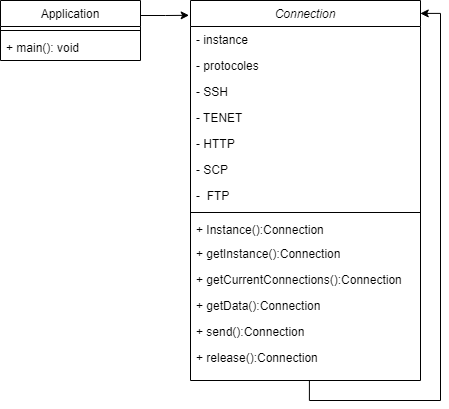

# Singleton design pattern

Singleton design pattern allows us to create one object from the class.

## Getting Started

### Prerequisites

The things you need before installing the software.

* You need install python
* And you need Code Editor(vscode, atom, pycharm, ..)

